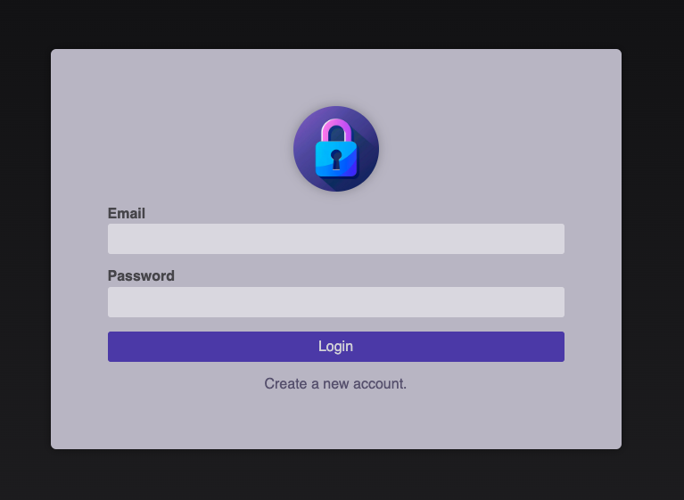
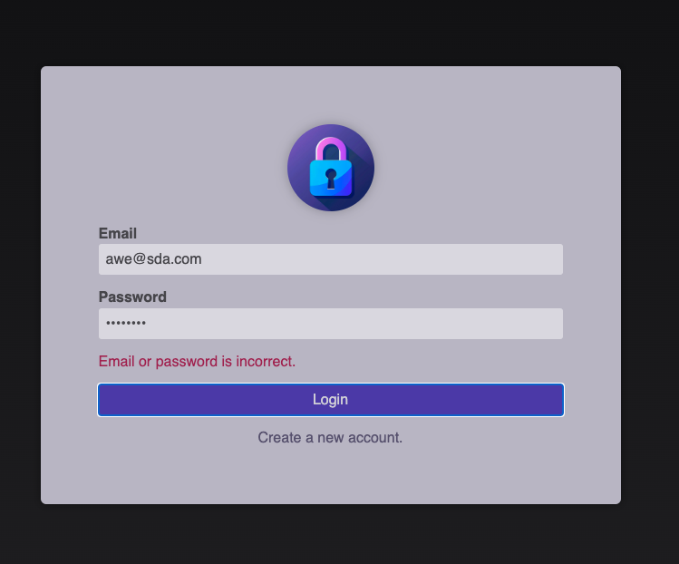
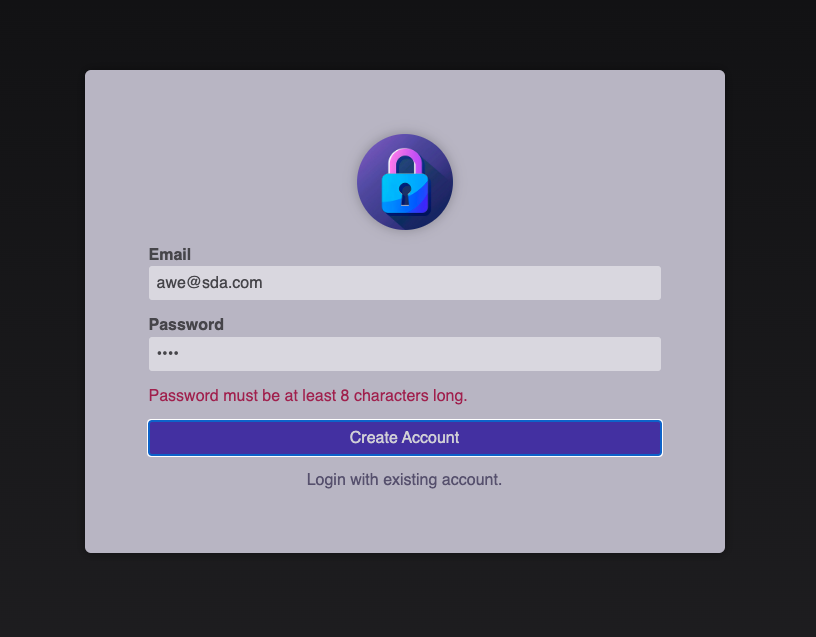
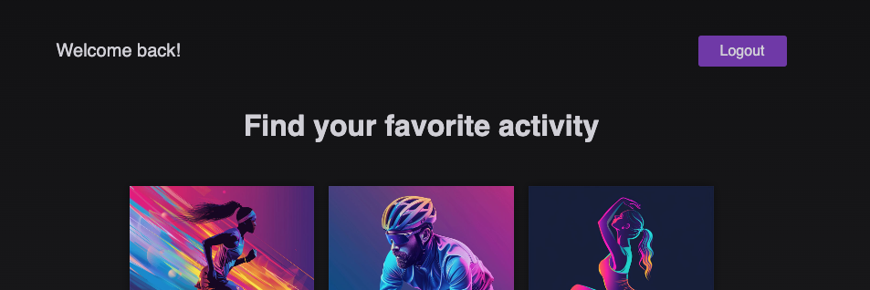

# Next Auth - (Lucia)

### Walkthrough Project created as part of [Maximilian Schwarzmüller's Next.js 14 course](https://www.udemy.com/course/nextjs-react-the-complete-guide/), showcasing email authentication and authorization with the Lucia package. (This version includes bug fixes which are present in original videos.)








This is a [Next.js](https://nextjs.org/) project bootstrapped with [`create-next-app`](https://github.com/vercel/next.js/tree/canary/packages/create-next-app).

## How to run the project

First, clone the project then run the development server:

```bash
npm run dev
# or
yarn dev
# or
pnpm dev
# or
bun dev
```

Open [http://localhost:3000](http://localhost:3000) with your browser to see the result.
